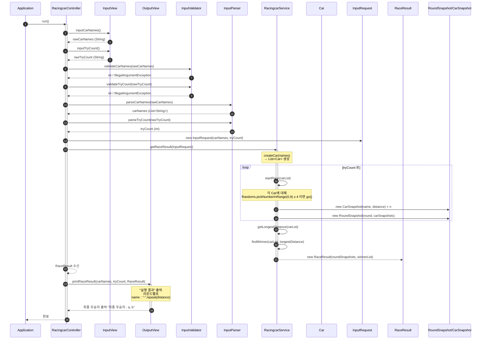

# java-racingcar-precourse

## 기능 목록

### 메인 로직
- [x] 입력 받은 문자열로부터 자동차 이름을 추출한다.
- [x] 자동차 도메인의 초기값을 설정한다.
- [x] 각 자동차에 대해 시도마다 랜덤값으로 전진 여부를 판단한다.
- [x] 한 번의 시도마다 자동차 도메인에 결과를 반영하고 출력한다.
- [x] 가장 멀리 이동한 거리를 측정한다.
- [x] 가장 멀리 이동한 우승자 명단을 만든다.

### 입력 및 출력
- [x] 시작 시 안내 메시지를 출력한다. (`경주할 자동차 이름을 입력하세요.(이름은 쉼표(,) 기준으로 구분)`)
- [x] 사용자로부터 문자열을 입력 받는다.
- [x] 시도 횟수 질문 안내 메시지를 출력한다. (`시도할 횟수는 몇 회인가요?`)
- [x] 시도 횟수를 입력 받는다.
- [x] 실행 결과를 출력한다.
- [x] 최종 우승자를 출력한다.

### 예외처리
- [x] 입력된 자동차 이름이 null 혹은 공백일 경우 `IllegalArgumentException`을 발생시킨다.
- [x] 입력된 자동차 이름에 특수문자가 포함될 경우 `IllegalArgumentException`을 발생시킨다.
- [x] 입력된 자동차 이름이 5자를 초과할 경우 `IllegalArgumentException`을 발생시킨다.
- [x] 입력된 시도 횟수가 0 이하일 경우 `IllegalArgumentException`을 발생시킨다.
- [x] 입력된 시도 횟수가 2,147,483,648 이상인 경우 `IllegalArgumentException`을 발생시킨다.

### 추가적인 조건
- [x] 시도 횟수 자료형은 int로 설정한다. 그러므로 시도 횟수 최대 값은 2,147,483,647이다.
- [x] 시도 횟수가 0일 경우 잘못된 입력으로 판단한다.
- [x] 자동차 이름은 null 혹은 공백이 아니다.
- [x] 자동차 이름에 특수문자가 포함될 수 없다.

## 프로젝트 구조

src/
├─ main/
│  └─ java/racingcar/
│     ├─ Application.java
│     ├─ controller/
│     │  └─ RacingcarController.java
│     ├─ service/
│     │  └─ RacingcarService.java
│     ├─ model/
│     │  └─ Car.java
│     ├─ validator/
│     │  └─ InputValidator.java
│     ├─ parser/
│     │  └─ InputParser.java
│     ├─ dto/
│     │  ├─ InputRequest.java
│     │  ├─ RaceResult.java
│     │  ├─ RoundSnapshot.java
│     │  └─ CarSnapshot.java
│     └─ view/
│        ├─ InputView.java
│        └─ OutputView.java
└─ test/
└─ java/racingcar/
├─ ApplicationTest.java
├─ model/CarTest.java
├─ validator/InputValidatorTest.java
├─ parser/InputParserTest.java
└─ service/RacingcarServiceTest.java

## 패키지 별 역할

- controller: 입력 수집 → validate/parse → DTO → service → view 위임
- service: 라운드 시뮬레이션, 스냅샷 생성, 우승자 산출
- model: 도메인 엔티티(Car)
- validator: 입력 형식/제약 검증
- parser: String → List<String>, int 변환
- dto: 레이어 간 불변 전송 모델
- view: 경주 정보 입력 및 결과/우승자 출력

## 다이어그램

